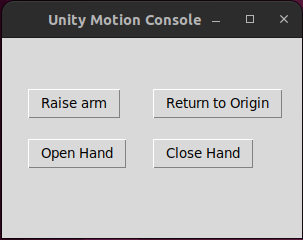

# RoboBreizh@Home Digital Twins for Softbank Pepper

## Summary
This repository provides a Digital Twins framework for Softbank Pepper running on Unity Engine. It contains asset files for Unity Engine and NaoqiWrapper python scripts to connect virtual and physical Pepper robots simultaneously. The communication pipeline in our framework is bidirectional, so we can either control virtual and real Pepper together at the same time or real Pepper directly sending commands to virtual Pepper or vice versa. Our digital twins' architecture is illustrated below. Instead of using ROS middleware compiled in Unity, our project utilises qi API and ZeroMq(zmq) websocket API as the middleware to form a communication bridge between virtual and physical Pepper. Therefore, our framework is flexible to be implemented in other 3D game engines, such as Unreal Engine. Our 3D arena model was constructed based on our lab environment. We used Blender as a 3D model software to design our 3D objects. For more information about creating 3D objects to the simulation engine , please refer [here](https://github.com/RoboBreizh-RoboCup-Home/Simulation_Assets).

<p align=""></p>

## Video Demonstration

We have a [video](https://youtu.be/j-0Rkxu1bwI) demonstration showing digital twins applications in vision, joint movement, motion control and VR interaction with Pepper.

## Dependencies (Python and C#@Unity)
```
naoqi-bin
qi
zmq@Python
zmq@UnityEngine
```

1. To install qi on Python3, please refer [libqi repository](https://github.com/aldebaran/libqi-python). This project uses Python3.10 running on Ubuntu Linux 22. 

2. To install zmq@Python
```
pip install zmq
```
3. Zmq@UnityEngine websocket plugins are already included in the [ZMQ folder](https://github.com/RoboBreizh-RoboCup-Home/NaoqiUnityWrapper-PepperDT/tree/main/Assets/ZeroMQ) located in the assest directory, just simply copy the asset folder to your created Unity Project and zmq API will be avilable in the C# library.

## Required hardware
A computer running Linux (Installed with qi library running NaoqiWrapper)<br/>
A computer running Windows (Installed with [Unity Engine](https://unity.com/download) and [Oculus Quest 2 app](https://www.meta.com/au/quest/setup/))<br/>
Oculus Quest 2

## Unity Engine version
For this project we are using 2021.3.13f1 version of Unity Engine. But running this framework in other version should not have any compilation error.

## Virtual Pepper URDF
The original pepper URDF file is available in [here](https://github.com/ros-naoqi/pepper_robot). But our team has modified the physics and joint angle to deliver a more accurate motion movement based on the real Pepper. Link to our modified [virtual Pepper](https://github.com/RoboBreizh-RoboCup-Home/NaoqiUnityWrapper-PepperDT/blob/main/Assets/pepper_robot/pepper_for_grasp.urdf) for grasping task ie. Fingers are included. For simplicity, only right arm is modified, future researcher can modify both arms and other joints. 

## Steps to run this DT

1. Installed Unity Engine and Oculus Quest 2 app (if VR is needed) on Windows 
2. Installed naoqi-bin, qi API and zmq API on Linux
3. Clone this repository and copy the Asset, Packages, ProjectSetting and UserSetting to Unity Engine.
4. Copy the NaoqiWrapper folder to Linux computer.
5. Run the naoqi-bin
6. Make sure the real Pepper and all computers are running in the same local network
7. Enter Game mode in Unity Engine
8. Run the DigitalTwinWrapper.py

## Python DigitalTwinWrapper
The following main function is cropped from the DigitalTwinsWrapper.py. You can set UNITY/PEPPER = 1 to access the virtual robot or real robot or controlling both at the same time. 
```python
if __name__ == '__main__': 
    
    # use this ip for local computer only
    
    # rgb_ip = "tcp://127.0.0.1:5001"
    # depth_ip = "tcp://127.0.0.1:5002"
    # cmd_vel_ip = "tcp://127.0.0.1:5003"
    # motion_ip = "tcp://127.0.0.1:5004"
    # stt_ip = "tcp://127.0.0.1:5005"
    # tts_ip = "tcp://127.0.0.1:5006"

    # Assign your local network with the Windows laptop running Unity
    rgb_ip = "tcp://192.168.50.92:5001"
    depth_ip = "tcp://192.168.50.92:5002"
    cmd_vel_ip = "tcp://192.168.50.42:5003"
    motion_ip = "tcp://192.168.50.42:5009"
    stt_ip = "tcp://192.168.50.42:5005"
    tts_ip = "tcp://192.168.50.42:5006"    
    
    # Connect to your Pepper robot via qi session
    pepper_session = qi.Session()
    pepper_session.connect("tcp://192.168.50.44")
    
    # Choose whether you wan to access Virtual Robot or Physical Robot or both simultaneously
    UNITY = 1
    PEPPER = 1
    
    if PEPPER == 1:
        PEPPER_MOTION = 1
        PEPPER_POSTURE = 1
        PEPPER_CAMERA = 1
    
    qiApp = qi.Application(sys.argv)
    qiApp.start()
    wrap = NaoqiUnityWrapper(qiApp, rgb_ip,depth_ip,cmd_vel_ip, motion_ip, stt_ip, tts_ip, pepper_session, UNITY, PEPPER_CAMERA, PEPPER_POSTURE, PEPPER_MOTION)
    
    # To unplug the qi socket properly
    signal.signal(signal.SIGINT, wrap.signal_handler)
    
    # Start functions to access virtual and real Pepper
    wrap.StartCamera()
    wrap.setVelocityUnity(0.5,0,5) # linear x, linear y ,Theta # at the moment, Our virtual pepper in Unity is unable to move in Y axis.
    wrap.setVelocityReal(0.5,0,0.5) # linear x, linear y ,Theta
    wrap.StartNavigation()
    joint = ["RShoulderPitch", "RShoulderRoll", "RElbowRoll", "RWristYaw"]
    wrap.setUnityPepperAngle(joint, [-60,-10, 25, 104.5])
    wrap.setRealPepperAngle(joint, [0.2,-0.5, 0.2, 3.0])    
    wrap.StartMotion()
    
    # For speech to text only
    #wrap.StartSTT()
    #wrap.StartTTS()

    # Exit properly
    print('Press Ctrl+C')
    signal.pause()
    wrap.close()
 ```

### Camera
RGB Camera and Depth Camera for both virtual and real Pepepr will be synchonised after you run the wrapper.

### WheelMotion
You can set linear x and angular z velocity in main function. We have created a GUI (see image below) to allow you to control/navigate both Pepper accordingly. Navigation setting refer to [ALNavigationUnity.py](https://github.com/RoboBreizh-RoboCup-Home/NaoqiUnityWrapper-PepperDT/blob/main/NaoqiWrapper/navigation/ALNavigationUnity.py)

<p align=""></p>

### Joint Motion
You can also set the joint angle in the main function to move virtual and real Pepper's joints. We have created a GUI (see image below) to allow you to control Pepper's right arm accordingly. At the moment, only RShoulder, RBicep, RForearm, RWrist and right hand fingers are avilable to be manipulated in Unity Engine. Future researcher can modify the [Joint movement script](https://github.com/RoboBreizh-RoboCup-Home/NaoqiUnityWrapper-PepperDT/blob/main/Assets/ZeroMQ/Controller/handwave/MotionPlanning.cs) in Unity to make other joint movement available. 

<p align=""></p>


### Speech communication with virtual Robot
You can uncomment wrap.StartSTT() and wrap.StartTTS() to run SpeechToText VOSK model and the text message will be sent/receive to/from Unity Engine.

## Unity C# scripts for robotics
Here are the examples of scripting robotic applications in C# Unity: 
1. [RGB Camera](https://github.com/RoboBreizh-RoboCup-Home/NaoqiUnityWrapper-PepperDT/blob/main/Assets/ZeroMQ/Camera/rgbCamera/script/RGBCamera.cs)
2. [Depth Camera](https://github.com/RoboBreizh-RoboCup-Home/NaoqiUnityWrapper-PepperDT/blob/main/Assets/ZeroMQ/Camera/depthCamera/scripts/depth_script.cs)
3. [WheelController](https://github.com/RoboBreizh-RoboCup-Home/NaoqiUnityWrapper-PepperDT/blob/main/Assets/ZeroMQ/cmd_vel/NaoqiController.cs)
4. [JointController](https://github.com/RoboBreizh-RoboCup-Home/NaoqiUnityWrapper-PepperDT/blob/main/Assets/ZeroMQ/Controller/handwave/MotionPlanning.cs)
5. [Speech Publisher](https://github.com/RoboBreizh-RoboCup-Home/NaoqiUnityWrapper-PepperDT/blob/main/Assets/ZeroMQ/SpeechToText/NaoqiSpeechToTextPublisher.cs)
6. [Speech Subscriber](https://github.com/RoboBreizh-RoboCup-Home/NaoqiUnityWrapper-PepperDT/blob/main/Assets/ZeroMQ/SpeechToText/NaoqiSpeechToTextSubscriber.cs)


## Previous Work@Unity (ROS2 Humble compilation)
We have previously implemented ROS middleware in Unity Engine, for more information, please refer this [respository](https://github.com/RoboBreizh-RoboCup-Home/UnitySimulation). However, sending ROS messages through the TCP conenctor is not as efficient as using Naoqi/qi framework.
